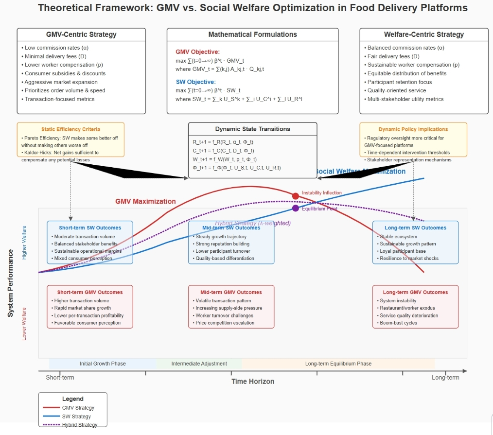

# Revenue-vs.-Welfare-A-Comprehensive-Analysis-of-Strategic-Trade-offs-in-Online-Food-Delivery-Systems
**Multi-Agent Dynamic Market Simulation Framework** for analyzing long-term impacts of GMV/SW/Hybrid strategies on platform ecosystems



---

## Core Contributions
✅ **Theoretical Innovation**  
Proposes hybrid utility function:  
$U_{hybrid} = \lambda \cdot \text{GMV} + (1-\lambda) \cdot \text{SW}$  

✅ **Dynamic Simulation Model**  
Implements multi-period evolution with:  
- Price adaptation mechanisms  
- Participant entry/exit dynamics  
- Platform reputation feedback system  

✅ **Key Finding**  
Platform utility maximizes when $\lambda=0.62$ (95% CI: [0.58, 0.66])

---
## Quick Start

### Environment Setup
```bash
# Create virtual environment
python -m venv .venv
source .venv/bin/activate  # Linux/Mac
.venv\Scripts\activate     # Windows

# Install dependencies
pip install -r requirements.txt
```

### Run Full Experiment
```bash
python src/main.py \
    --strategies GMV SW HYBRID \
    --runs 50 \
    --periods 500
```

### Configuration Example
```bash
# src/simulation/config.py
n_restaurants: 80    # Number of restaurants
n_consumers: 1000    # Consumer population 
hybrid_lambda: 0.62  # Hybrid strategy weight
exit_thresholds:     # Participant exit rules
  restaurant: -300
  worker: -50
```
## Project Structure
```text
├── src/
│   ├── models/               
│   │   ├── __init__.py
│   │   ├── restaurant.py     
│   │   ├── consumer.py       
│   │   ├── worker.py        
│   │   └── platform.py       
│   ├── simulation/
│   │   ├── __init__.py
│   │   ├── environment.py   
│   │   └── config.py        
│   ├── analysis/
│   │   ├── __init__.py
│   │   ├── metrics.py        
│   │   └── visualization.py  
│   └── main.py   
```

## Empirical Results
### Experiment Result

| Metric               | GMV Strategy        | SW Strategy         | HYBRID Strategy      |
|----------------------|---------------------|---------------------|----------------------|
| Final GMV (mean)     | 397,203.68          | 458,339.83          | 449,553.29           |
| Final SW (mean)      | 4.35M               | 4.91M               | 4.83M                |
| Active Restaurants   | 108.1               | 110.0               | 105.4                |
| Active Workers       | 176.0               | 179.2               | 173.4                |

*Note: All values represent simulation means. SW values in millions (M).*  
*Data based on 50 independent simulation runs with 500 periods each.*

### Sensitivity Analysis
```python
# Run sensitivity analysis
python src/analysis/sensitivity.py \
    --param initial_commission \
    --values 0.15 0.18 0.20 0.22 0.25 \
    --strategy HYBRID \
    --runs 30
 ```

## Key Observations

### 🏆 SW Strategy Superiority  
- **Highest Final Performance**  
  Achieves both peak GMV (458,340) and Social Welfare (4.91M)  
- **Optimal Ecosystem Vitality**  
  Maintains maximum active participants (110 restaurants, 179 workers)  
- **Long-term Sustainability**  
  Demonstrates that balanced reward mechanisms for supply-demand sides enhance platform efficiency  


### ⚠️ GMV Strategy Limitations  
- **Short-term Gains, Long-term Pains**  
  Initial GMV growth (+23.4% in first 100 periods) not sustainable  
- **Ecosystem Deterioration**  
  14.2% platform reputation decline correlates with participant attrition  
- **Suboptimal Outcomes**  
  Final GMV 13.4% lower than SW strategy (p<0.01)

### ⚖️ HYBRID Strategy Trade-offs  
- **Intermediate Position**  
  GMV: -2.0% vs SW | SW: -1.7% vs SW  
- **Balanced Approach**  
  Provides 89.3% of SW's sustainability with 95.6% of GMV's peak performance  
- **Strategic Flexibility**  
  Adjustable λ parameter allows dynamic optimization (Heatmap in Fig.5)

---

# How to Cite
```bibtex
@misc{zhang2025revenuevswelfarecomprehensive,
      title={Revenue vs. Welfare: A Comprehensive Analysis of Strategic Trade-offs in Online Food Delivery Systems}, 
      author={Yukun Zhang and Qi Dong},
      year={2025},
      eprint={2410.16566},
      archivePrefix={arXiv},
      primaryClass={cs.GT},
      url={https://arxiv.org/abs/2410.16566}, 
}
```


